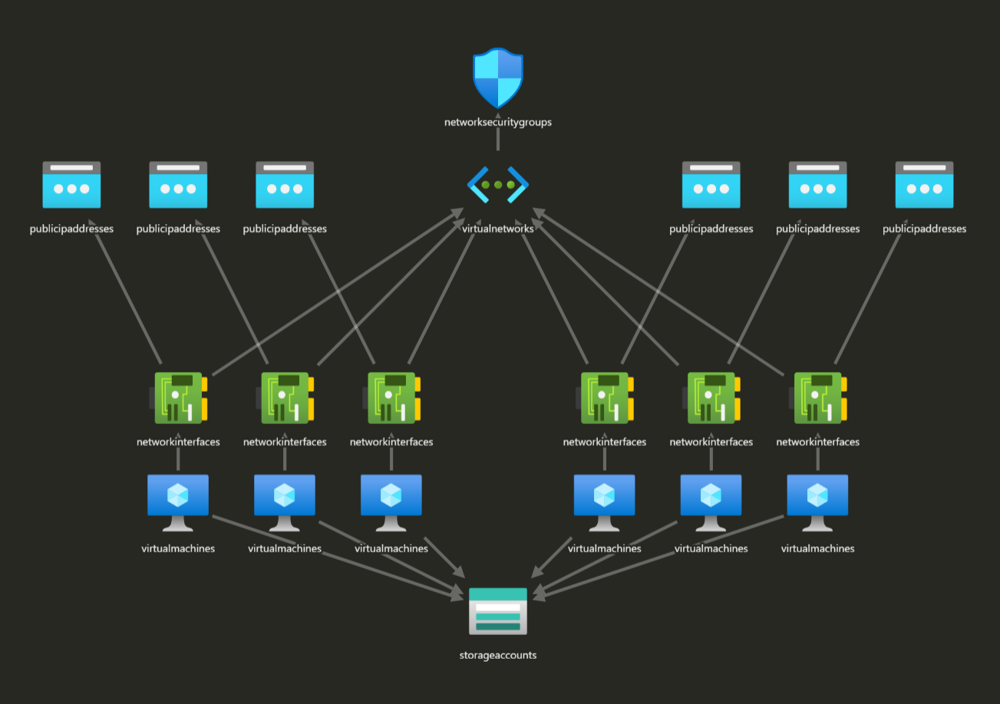

# arm-template-authBasic

よく作るような環境のテンプレートを作成してみました。
リソースグループから、テンプレート作れるので、みんなもこれを参考にやってみよう！


[](https://portal.azure.com/#create/Microsoft.Template/uri/https%3a%2f%2fraw.githubusercontent.com%2fryuya-M%2farm-template-authBasic%2fmaster%2fvm-myenv-template-ver3.json)

### パラメータの補足

Location : 有効な場所を指定しないといけません。以下のコマンドなどで指定する際の文字列を確認してください。
```
az account list-locations --query "[].name"
```

Virtual Machine Prefix : VM の Prefix。Prefix-dc とか Prefix-adfs などの名前で作成される。
Prefix-proxy (Azure AD App Proxy を想定) があり、VM のマシン名は 15 字以下などの制限があるので、9 字以内にしてね。

Virtual Machine Size : 後から変更できます。

Dns Prefix : Public IP Address に対する DNS 名。DNSPrefix-VMName.<reagion>~~~ という DNS 名になります。
  
### デプロイされるイメージ



## next step

以下のテンプレートを同じリージョンに Deploy しよう。証明書の取得がとっても簡単。

https://github.com/shibayan/keyvault-acmebot/blob/master/README_ja.md

## next

以下のリンクを参照に、AD FS / Wap サーバーなどに証明書を割り当ててしまいましょう！

[./sample-keyvault-certattach.md](./sample-keyvault-certattach.md)
